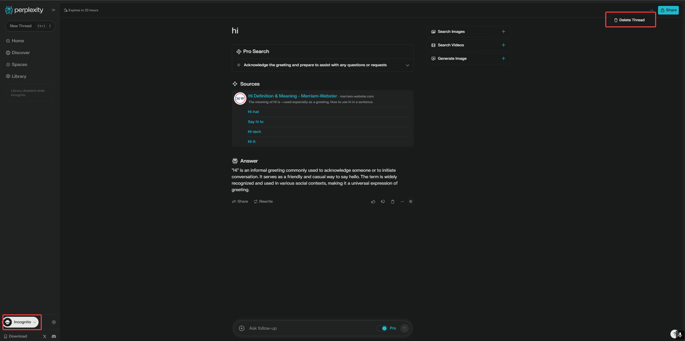

# I wonder what lies here...

## Tutorial to share cookies 😇😇😇

### Getting your own cookies
1. The "cookies" will be updated in this repository.
2. It will be updated every 7 days. **Don't eat expired cookies.**
3. You should get your own cookies from the file `cookies.json`.

### Eating your own cookies

> For chrome/chromium browsers, you can use the extension [EditThisCookie](https://chromewebstore.google.com/detail/editthiscookie/ojfebgpkimhlhcblbalbfjblapadhbol) to *eat* your cookies.

> For iPad users, you can use the app [Cookie-Editor](https://apps.apple.com/us/app/cookie-editor/id6446215341) to *eat* your cookies.
 Note that you have to use Safari as browser.

After installing the extension/app, you should know that the cookies are stored in the file `cookies.json`.  
You should copy the cookies from the file `cookies.json`,  
and then import the cookies on the website by using the **import function** of the extension/app.

### Reminder

**Always toggle the incognito mode and delete thread after use.**
